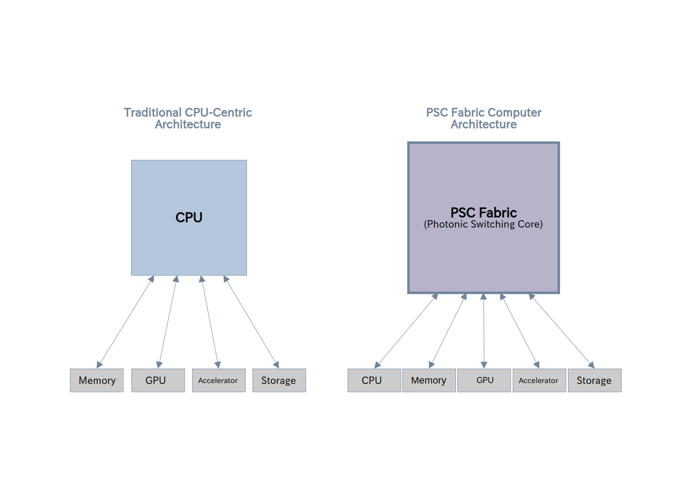

# Photon System Controller (PSC)

Photon System Controller (PSC) is a fabric-driven computer architecture designed for high-performance distributed computing and AI infrastructure.

PSC rethinks the traditional CPU-centric system architecture and introduces a fabric-centric communication model where all devices communicate through a unified fabric.

---

## PSC Concept

## Key Concepts

PSC is built around several core ideas:

- Fabric-driven computer architecture
- Receiver-driven data transfer
- Chunk-based transport
- Congestion-aware routing
- Policy-aware routing
- Trust-aware routing
- Adaptive fabric control

The architecture aims to support large-scale distributed AI systems and high-performance computing environments.

---

## Architecture Overview

PSC introduces a communication fabric that connects all major system components:

- CPU
- GPU
- Memory
- Storage
- Network
- Accelerators

All communication flows through the **PSC Fabric**, enabling flexible routing, monitoring, and policy control.

---

## Specification

Current PSC specifications are available in the repository:

- Address Format
- Node Addressing Model
- Packet Structure
- Port Model
- Transfer Flow
- Routing Model
- Routing Table Model
- Routing Algorithm

Each specification is provided in both Japanese and English.

---

## Project Status

Current version:

# PSC Fabric Specification v0.1

This directory contains the published specification set for PSC Fabric.

## Core Communication Models
- PSC Address Format
- PSC Packet Structure
- PSC Transfer Flow
- PSC Port Model

## Routing and Fabric Control
- PSC Routing Model
- PSC Routing Table Model
- PSC Routing Algorithm
- PSC Routing Decision Pipeline
- PSC Congestion Control Model
- PSC Fabric State Model
- PSC Control Plane Model

## Fabric Structure
- PSC Node Addressing Model
- PSC Node Type Model
- PSC Fabric Topology Model
- PSC Chiplet Architecture Model

## Governance and Observability
- PSC Policy Model
- PSC Security Model
- PSC Telemetry Model

---

## Author

T. Hirose

Independent architecture research project.
