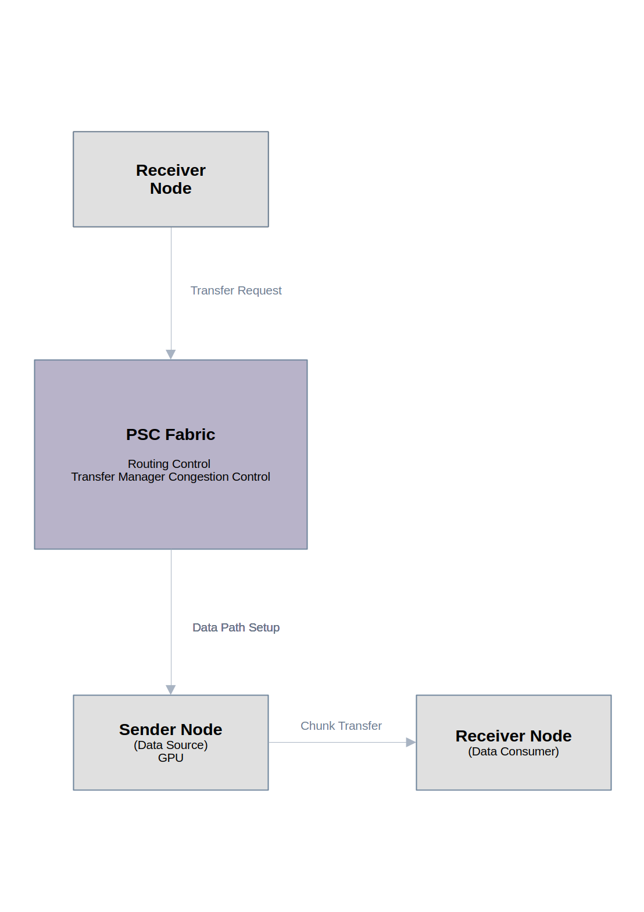
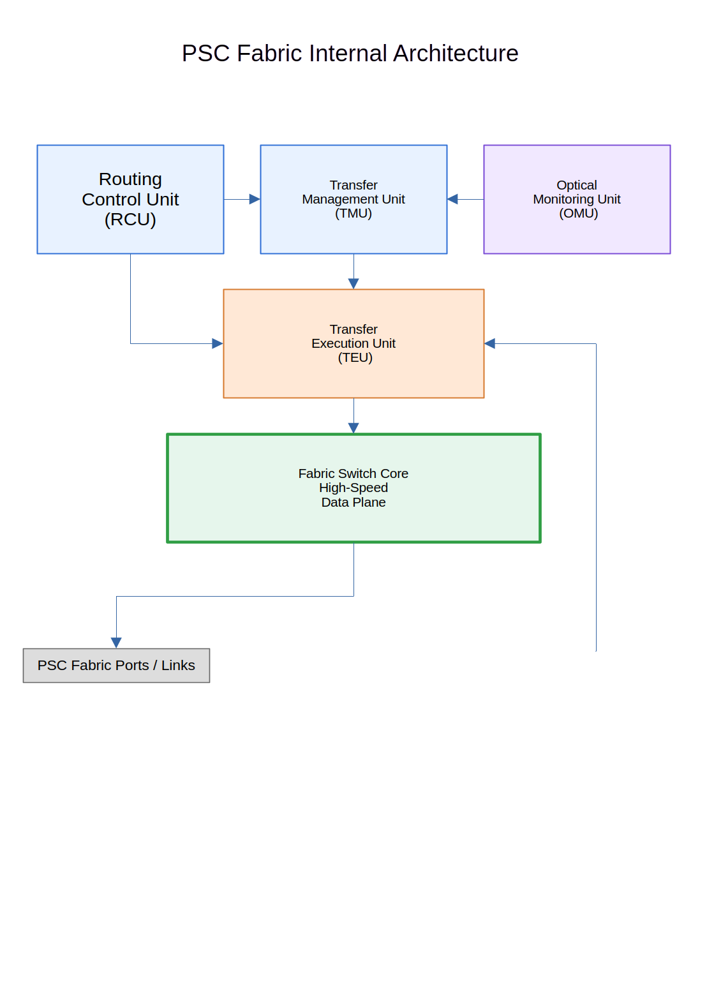

# Photon System Controller (PSC)

## 🚀 Quick Demo（クイックデモ）

Try PSC behavior in seconds:  
（数秒でPSCの動作を体験できます）

### Static Demo（静的デモ）
```bash
python3 sim/04_demo/run_psc_demo.py
```
Basic trust-aware routing decision.
（信頼性を考慮した基本的なルート選択）

### Dynamic Demo（動的デモ）
```bash
python3 sim/04_demo/run_psc_dynamic_demo.py
```
Adaptive routing with changing network conditions.
（ネットワーク状態の変化に応じた適応的ルーティング）

This demo shows how PSC selects routes based on:
（このデモでは、PSCが以下の要素に基づいて経路選択する様子を確認できます）

- cost（コスト）
- trust（信頼性）
- adaptive decision logic（適応的な判断ロジック）

PSC does not always choose the shortest path —
it prefers stable and trusted routes.
（PSCは常に最短経路を選ぶわけではなく、安定性と信頼性を優先します）

## 📄 Article（記事）

👉 Read the concept:

**[A Fabric-Centric Computer Architecture: PSC](https://zenn.dev/takanori_psc/articles/73827700dc68a6)**

---

## What is PSC?（PSCとは何か）

PSC is a fabric-centric computer architecture designed to shift system control and data movement away from traditional CPU-centric designs.  
（PSCは、従来のCPU中心設計から、ファブリック中心の制御とデータ転送へ移行するコンピュータアーキテクチャです。）

In PSC, the communication fabric itself becomes the core of coordination and data flow.  
（PSCでは、通信ファブリックそのものがシステムの制御とデータ流通の中心となります。）

In simple terms, PSC shifts the role of system control from the CPU to the communication fabric.  
（簡単に言うと、PSCはシステム制御の主役をCPUから通信ファブリックへ移す構造です。）

---

## Architecture Overview（アーキテクチャ概要）


PSC replaces traditional CPU-centric communication with a unified fabric model, enabling flexible and scalable data movement.  
（PSCは従来のCPU中心通信を統一ファブリックモデルに置き換え、柔軟でスケーラブルなデータ転送を実現します。）

---

## Documentation（ドキュメント）

Start here to understand PSC:  
（ここからPSCの理解を開始できます）

* 📘 [Architecture Overview](docs/architecture/psc_architecture_overview_en.md)
* 🧭 [Architecture Map](docs/architecture/psc_architecture_map_v0.1_en.md)
* 📚 [Specification](docs/specification/)

---

## Key Concepts（主要コンセプト）

PSC is built around the following principles:  
（PSCは以下の原則に基づいています）

* Fabric-driven computer architecture  
  （ファブリック駆動型アーキテクチャ）

* Receiver-driven data transfer  
  （受信側主導データ転送）

* Chunk-based transport  
  （チャンク単位転送）

* Congestion-aware routing  
  （輻輳認識ルーティング：混雑を考慮した経路制御）

* Policy-aware routing  
  （ポリシー認識ルーティング）

* Trust-aware routing  
  （信頼性考慮ルーティング）

* Adaptive fabric control  
  （適応型ファブリック制御）

---

## Architecture Diagrams（構造図）

### Transfer Flow（転送フロー）



### Fabric Internal Architecture（ファブリック内部構造）



---

## System Architecture（システム構造）

PSC introduces a communication fabric that connects:  
（PSCは以下の構成要素をファブリックで接続します）

* CPU  
* GPU  
* Memory（メモリ）  
* Storage（ストレージ）  
* Network（ネットワーク）  
* Accelerators（アクセラレータ）

All communication flows through the PSC Fabric.  
（すべての通信はPSCファブリックを通過します。）

---

## Specification（仕様）

The PSC specification includes:  
（PSC仕様には以下が含まれます）

* Addressing（アドレッシング）  
* Communication Protocol（通信プロトコル）  
* Routing（ルーティング）  
* Fabric Control（ファブリック制御）  
* Security（セキュリティ）  
* Telemetry（テレメトリ）

📚 [Browse full specification](docs/specification/)

Each specification is available in both Japanese and English.  
（各仕様は日本語と英語の両方で提供されます）

---

## Project Status（開発状況）

PSC Fabric Specification v0.1 is currently under development.  
（PSC Fabric仕様 v0.1 は現在開発中です）

---

## Author（作者）

T. Hirose  
Independent architecture research project  
（個人によるアーキテクチャ研究プロジェクト）
