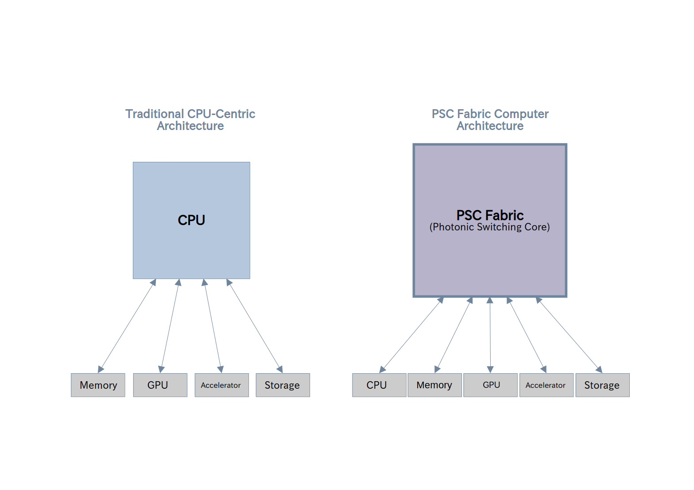
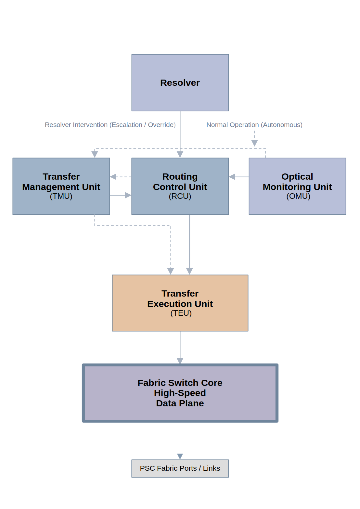
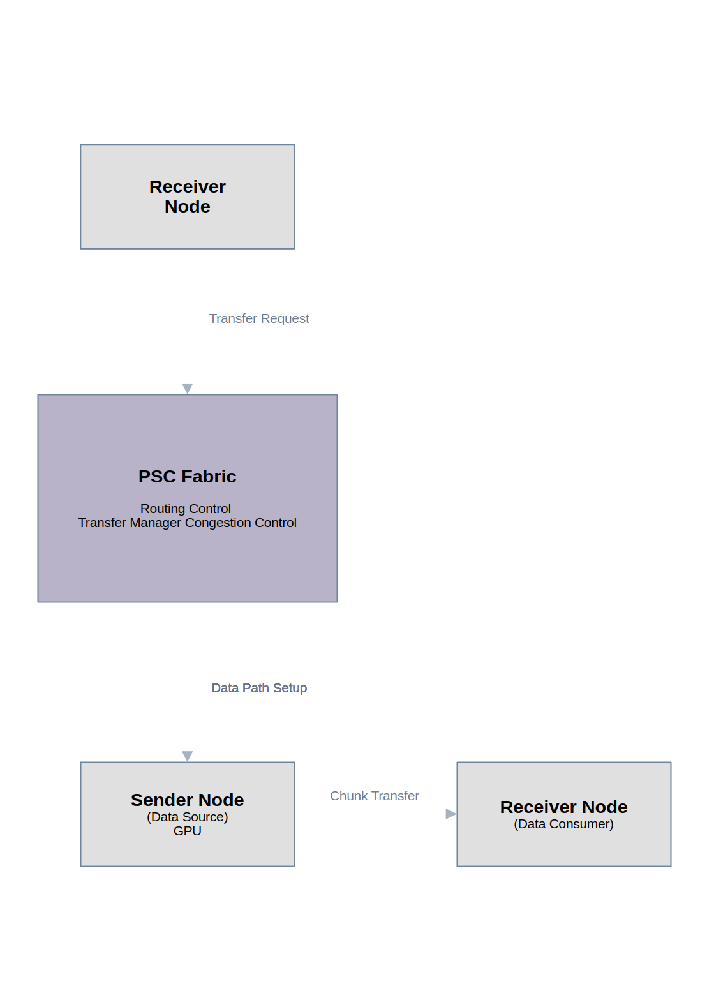
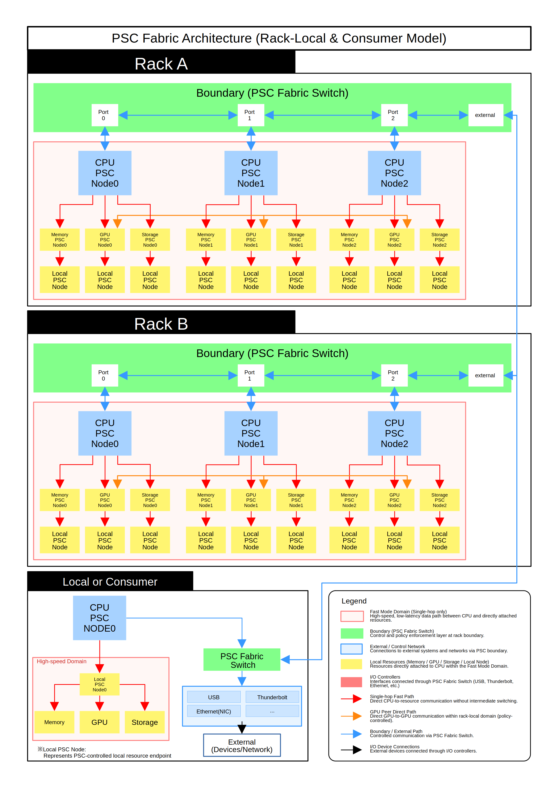

# Photon System Controller (PSC)

🇺🇸 English | 🇯🇵 日本語 → README_ja.md

A fabric-driven system that dynamically selects the most stable and trusted network path — not just the shortest one.

---

## Why PSC?

- Avoids unstable network paths automatically
- Prioritizes trust and stability over raw speed
- Adapts routing decisions in real time
- Moves decision-making into the network fabric

PSC is a **decision-driven routing system**, not just a data transport layer.

PSC prioritizes stability over immediate performance gains
across all phases: normal operation, degradation, and recovery.

---

## What is PSC?

PSC (Photon System Controller) is a stability-oriented fabric control architecture.
It shifts selected control and data-movement decisions away from traditional CPU-centric designs
and into the communication fabric.

PSC prioritizes resilient behavior over unstable peak throughput.
It targets AI, HPC, datacenter, and distributed systems
where stable behavior matters more than unstable peak throughput.

The core focus is controlled recovery, oscillation resistance,
trust-aware routing, and RULE-driven decision control.

---

## Why Photon?

"Photon" indicates a fabric-oriented control model where optical links,
high-speed interconnects, and path-level observation can become first-class control inputs.

This README focuses on the control-plane model first:
stable routing, recovery, trust, and oscillation resistance.
Photonic and optical fabric details are developed in the fabric and architecture documents.

---

## Design Philosophy

PSC is designed not only for high-speed communication,
but also for stability, trust-aware control,
containment, and recovery-oriented operation
within large-scale distributed systems.

- English:
  docs/specification/published/vision/psc_design_philosophy_v0.1_en.md

- Japanese:
  docs/specification/published/vision/psc_design_philosophy_v0.1_ja.md

---

## Recommended Reading Flow

For a first read, use this order:

| Step | Section | Purpose |
| --- | --- | --- |
| 1 | What is PSC? | Understand the stability-oriented control goal |
| 2 | Core Components | Learn the main PSC terms before reading diagrams |
| 3 | [Quick Start](QUICK_START.md) | Run PSC simulations and inspect generated logs |
| 4 | Validation / Evidence | Follow RULE-to-scenario-to-log traceability |
| 5 | Architecture Overview | Place RCU, Resolver, transfer, and fabric roles in context |
| 6 | Specification | Separate published models from evolving drafts |
| 7 | Quick Demo / Validation Logs | Reproduce behavior from generated logs |

---

## Further Reading

| Document | Purpose |
| --- | --- |
| [QUICK_START.md](QUICK_START.md) | Minimal path to run PSC simulations and inspect generated logs |
| [Architecture Overview](docs/architecture/psc_architecture_overview_en.md) | Architecture-level view of PSC Fabric, Resolver, and control flow |
| [Published Models](docs/specification/published/models/) | Reference models for routing, control, recovery, trust, telemetry, and fabric behavior |
| [Evidence Matrix](docs/specification/validation/psc_evidence_matrix_v0.1_en.md) | RULE-to-scenario-to-log validation traceability |

---

## Core Components

| Component | Role |
| --- | --- |
| Resolver | Decision-control module. It handles escalation, override, and system-wide control choices when autonomous local control is insufficient. |
| RCU | Routing Control Unit. It selects and holds paths using trust, score, cooldown, degradation, and recovery rules. |
| TMU | Transfer Management Unit. It coordinates transfer-level intent, scheduling, and handoff between decision control and execution. |
| TEU | Transfer Execution Unit. It performs the actual transfer behavior selected by the control layer. |
| OMU | Optical Monitoring Unit. It observes link, path, and fabric conditions used by control decisions. |
| Fabric | The communication substrate where PSC integrates routing, monitoring, transfer control, and decision feedback. |

---

## Start Here (RCU Decision v0.1)

This is the core of PSC.

The RCU Decision Model defines how PSC:
- avoids unstable paths
- prioritizes trust and stability
- prevents oscillation through controlled switching

If you want to understand PSC, start here.
This model is fully implemented and validated through simulation logs.

**Read the specification:**

docs/specification/published/models/psc_rcu_decision_model_v0.1_en.md

**How to run:**

Use the command in [Validation Logs](#validation-logs).

**Generated logs:**

`sim/02_controlled/02_rcu_decision_v01/logs/`

## Validation / Evidence

PSC validation behavior is organized through
traceable RULE-to-scenario-to-log mappings.

Reference:

- docs/specification/validation/psc_evidence_matrix_v0.1_en.md
- docs/specification/validation/psc_evidence_matrix_v0.1_ja.md

Recommended validation flow:

1. Read specification documents
2. Run simulation scenarios
3. Open Evidence Matrix
4. Verify corresponding logs

This traceability structure allows PSC behavior
to be reproducible, auditable, and directly linked
to RULE-based control decisions.

Detailed validation traceability is available in:

docs/specification/validation/psc_evidence_matrix_v0.1_en.md

Focus on:

- resolver_stability_conflict
- degraded / recovery behavior
- trust-aware decisions

---

## Validation Logs

The following logs provide reproducible validation of the PSC RCU Decision Model v0.1.
Each log is fully reproducible and directly linked to RULE-based decision traces.

All logs are directly generated from the simulation and reflect actual execution behavior.

**How to run:**

Use [QUICK_START.md](QUICK_START.md) for the minimal execution path.

**Generated logs:**

| Scenario | Log |
| --- | --- |
| Resolver Stability Conflict + Cooldown | `sim/02_controlled/02_rcu_decision_v01/logs/rcu_decision_v01_resolver_stability_conflict_cooldown_rule_log.md` |
| Degraded → Recovery → Stabilization | `sim/02_controlled/02_rcu_decision_v01/logs/rcu_decision_v01_degraded_switch_recovery_rule_log.md` |
| Resolver Switch Decision | `sim/02_controlled/02_rcu_decision_v01/logs/rcu_decision_v01_resolver_switch_rule_log.md` |

**Scenario descriptions:**

| Scenario | Behavior demonstrated | RULE references |
| --- | --- | --- |
| Resolver Stability Conflict + Cooldown | Near-equal scoring paths with a stability conflict trigger escalation to the Resolver. Cooldown prevents repeated escalation, and hysteresis maintains stability. | `RULE-05_ESCALATE_conflict`, `RULE-12_COOLDOWN_active`, `RULE-01_KEEP_score` |
| Degraded → Recovery → Stabilization | All paths lose trust, forcing degraded operation. PSC safely falls back, then recovers once conditions improve. | `RULE-09_DEGRADE_switch`, `RULE-08_DEGRADE_keep`, `RULE-10_RECOVERY_trigger`, `RULE-11_RECOVERY_cooldown`, `RULE-01_KEEP_score` |
| Resolver Switch Decision | Near-equal scoring paths with a strong trust difference trigger escalation. The Resolver explicitly switches the selected path. | `RULE-05_ESCALATE_conflict`, `RULE-14_RESOLVER_switch`, `RULE-12_COOLDOWN_active`, `RULE-01_KEEP_score` |

## What These Logs Prove

- PSC avoids unnecessary switching under ambiguity
- PSC safely degrades when trust conditions fail
- PSC recovers predictably without oscillation
- All decisions are traceable to explicit RULE definitions

> PSC is not an optimization engine.
> It is a **failure-resilient decision engine**.

### Recovery Behavior (Important)

PSC adopts a conservative recovery strategy.

Even when a previously degraded path recovers and becomes the best-performing path again,
PSC does not immediately switch back if the currently selected path remains stable and trusted.

This behavior prevents unnecessary switching and ensures stability after recovery,
rather than aggressively chasing performance improvements.

### Recovery Behavior Comparison (v0.1 vs v0.2)

The following comparison log demonstrates the difference between conservative recovery hold (v0.1)
and staged recovery return (v0.2).

**Log:**
[Recovery Comparison Log (v0.1 vs v0.2)](sim/02_controlled/06_recovery_return_v02/logs/rcu_decision_v02_recovery_return_vs_v01_recovery_hold_log.md)

**Key Difference:**

- v0.1:
  Holds the current stable path even after the original path recovers

- v0.2:
  Introduces staged recovery:
  RECOVERY_CANDIDATE → VALIDATION → RETURN_ELIGIBLE → RETURN_SWITCH

This comparison shows PSC's progression from stability-first hold behavior
to controlled adaptability through staged return, progressive migration,
and recovery ramp-style validation while preserving stability guarantees.

---

## Quick Demo

PSC provides two demo modes:

| Demo | How to run | What you will see |
| --- | --- | --- |
| Static Demo | `python3 sim/04_demo/run_psc_demo.py` | Basic trust-aware routing and stable path preference over shortest path |
| Dynamic Demo | `python3 sim/04_demo/run_psc_dynamic_demo.py` | Real-time routing adaptation, avoidance of unstable paths, and trust-driven decision changes |

---

## Architecture Overview

PSC shifts system control from a centralized CPU to the communication fabric.

**Key idea:**

- Control is distributed across the fabric
- Data flow and decision-making are integrated

This diagram compares traditional CPU-centric architecture with PSC’s fabric-driven model.

---

### Resolver Control Model

This diagram shows how decision-making works inside PSC.

**Key behavior:**

- RCU operates autonomously under normal conditions
- Resolver intervenes only when escalation or override is required
- Decision control is separated from execution

PSC is not just a data transport system —
it is a **decision-driven fabric architecture**.

---

## Transfer Flow

This diagram shows how PSC executes data transfer decisions within the fabric.

**What to focus on:**

- How data flows between components
- How routing decisions affect transfer behavior
- Interaction between control and execution layers

---

## Fabric Internal Architecture

This diagram shows the internal structure of the PSC fabric.

**What to focus on:**

- Roles of each module (RCU, TMU, TEU, OMU)
- Separation of control and execution
- How components are connected inside the fabric

---

## Architecture Reading Hints

Read the architecture diagrams as control-flow documents, not only topology diagrams.

- Start with where a decision is made: RCU locally, Resolver when escalation is required
- Then follow how that decision is executed: TMU coordination, TEU transfer behavior
- Finally check what evidence feeds the decision: OMU observation and fabric state

This order makes the control philosophy visible:
autonomous local behavior first, conservative escalation only when needed.

---

## Documentation

Start here to understand PSC:

- [Architecture Overview](docs/architecture/psc_architecture_overview_en.md)
- [Architecture Map](docs/architecture/psc_architecture_map_v0.1_en.md)
- [Specification](docs/specification/)

---

## Specification

PSC separates published reference models from intentionally evolving design areas.
The evolving areas extend the architecture without weakening the published stability model.

### Published / Stable Documents

These documents represent stable and reference-level specifications:

| Area | English | Japanese |
| --- | --- | --- |
| PSC Architecture Specification v1.0 | docs/specification/published/architecture/psc_architecture_spec_v1.0_en.md | docs/specification/published/architecture/psc_architecture_spec_v1.0_ja.md |
| RCU Decision Model v0.1 | docs/specification/published/models/psc_rcu_decision_model_v0.1_en.md | docs/specification/published/models/psc_rcu_decision_model_v0.1_ja.md |
| Routing Model v0.1 | docs/specification/published/models/psc_routing_model_v0.1_en.md | docs/specification/published/models/psc_routing_model_v0.1_ja.md |
| Congestion Control Model v0.1 | docs/specification/published/models/psc_congestion_control_model_v0.1_en.md | docs/specification/published/models/psc_congestion_control_model_v0.1_ja.md |
| PSC AI Behavior Model v0.1 | docs/specification/published/psc_ai_behavior_model_v0.1_en.md | docs/specification/published/psc_ai_behavior_model_v0.1_ja.md |

---

### Experimental / Evolving Documents

These documents describe controlled architectural progression beyond the baseline model:

| Area | English | Japanese |
| --- | --- | --- |
| RCU Recovery Return Model v0.2 | docs/specification/published/models/psc_rcu_recovery_return_model_v0.2_en.md | docs/specification/published/models/psc_rcu_recovery_return_model_v0.2_ja.md |
| Resolver Arbitration Extension Model v0.2x | docs/specification/published/models/psc_resolver_arbitration_extension_model_v0.2x_en.md | docs/specification/published/models/psc_resolver_arbitration_extension_model_v0.2x_ja.md |
| Recovery Return Extension Model v0.2x | docs/specification/published/models/psc_recovery_return_extension_model_v0.2x_en.md | docs/specification/published/models/psc_recovery_return_extension_model_v0.2x_ja.md |

These are not presented as unfinished foundations.
They explore new control surfaces while the stability-oriented recovery
and RULE-driven decision model remains the baseline.

---

### Core Specification

| Area | English | Japanese |
| --- | --- | --- |
| Resolver Specification v0.1 | docs/specification/resolver/psc_resolver_spec_v0.1_en.md | docs/specification/resolver/psc_resolver_spec_v0.1_ja.md |

The Resolver defines the decision-control model of PSC,
including state-based control, authority modes, and constraint-based outputs.

---

## Key Concepts

PSC is built around the following principles:

- Fabric-driven computer architecture
- Receiver-driven data transfer
- Chunk-based transport
- Congestion-aware routing
- Policy-aware routing
- Trust-aware routing
- Adaptive fabric control

---

## Short Glossary

| Term | Meaning |
| --- | --- |
| RULE | Explicit decision condition used to make behavior reproducible and auditable. |
| Trust | Operational confidence in a path, combining reliability, policy fit, validation state, and observed behavior. |
| Escalation | Transfer of decision authority from autonomous RCU behavior to Resolver control. |
| Cooldown | A suppression window that prevents repeated switching or repeated escalation. |
| Degraded mode | Controlled operation when trust or path conditions are insufficient for normal selection. |
| Recovery | Return from degraded behavior through stable, controlled transitions rather than immediate performance chasing. |
| Oscillation resistance | PSC's preference for stable behavior when rapid switching would reduce system reliability. |

---

## Beyond Network Routing

PSC is not limited to datacenter-scale routing control.

The same control philosophy can also be applied to:

- CPU-GPU local fabrics
- accelerator interconnects
- rack-scale communication
- photonic internal buses
- trusted high-speed local transfer domains

This allows PSC to extend beyond traditional networking
into fabric-centric computer architecture.

In this view, the fabric is not only a transport layer.
It becomes the place where transfer, observation, recovery,
and control decisions are integrated.

---

## System Architecture

PSC introduces a communication fabric that connects:

- CPU
- GPU
- Memory
- Storage
- Network
- Accelerators

All communication flows through the PSC Fabric.

---

## Article

Read the concept:

[https://zenn.dev/takanori_psc/articles/73827700dc68a6](https://zenn.dev/takanori_psc/articles/73827700dc68a6)

---

## Project Status

PSC has published reference models and validation logs for its stability-oriented control behavior.
Fabric-level specifications continue to evolve as part of the architecture progression,
with conservative recovery and RULE-driven decision control preserved as core constraints.

---

## Author

T. Hirose
Independent architecture research project

---

## Contributing

Contributions, discussions, and ideas are welcome.

See `CONTRIBUTING.md`

---
