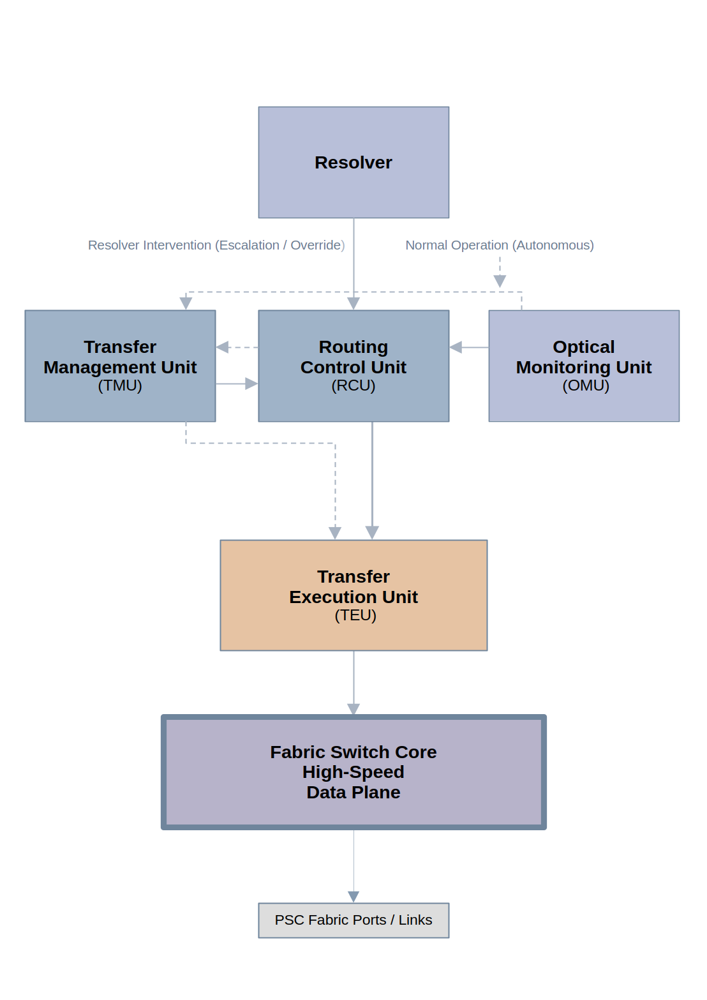

# Photon System Controller (PSC)

🇯🇵 日本語 | 🇺🇸 English → README.md

安定性と信頼性に基づいて、最適なネットワーク経路を動的に選択するファブリック制御システム
（単なる最短経路選択ではありません）

---

## PSCとは何か？

PSC（Photon System Controller）は、従来のCPU中心の制御から脱却し、
通信ファブリック自体が制御とデータ転送の中心となる新しいコンピュータアーキテクチャです。

中央集権的な制御に依存せず、
ファブリック内で分散的に意思決定を行う点が特徴です。

---

## なぜPSCなのか？

- 不安定なネットワーク経路を自動的に回避
- 単純な速度ではなく、信頼性と安定性を優先
- ネットワーク状態の変化に応じてリアルタイムに適応
- 意思決定をネットワーク内部に移動

PSCは単なるデータ転送機構ではなく、
**意思決定を行うルーティングシステム**です。

---

## デモ

PSCの動作は2種類のデモで確認できます。

### 1. 静的デモ（基本動作）

信頼性とコストに基づく基本的なルーティング動作を確認できます。

**確認できる内容：**

- 信頼性を考慮した経路選択
- 最短経路よりも安定した経路を優先

```bash
python sim/04_demo/run_psc_demo.py
```

---

### 2. 動的デモ（適応動作）

ネットワーク状態の変化に対するPSCの挙動を確認できます。

**確認できる内容：**

- リアルタイムな経路適応
- 不安定な経路の回避
- 信頼性に基づく意思決定の変化

```bash
python sim/04_demo/run_psc_dynamic_demo.py
```

---

## アーキテクチャ概要

PSCは、システム制御をCPUから通信ファブリックへ移行します。

**ポイント：**

- 制御はファブリック全体に分散
- データ転送と意思決定が統合されている


従来のCPU中心構造と、PSCのファブリック中心構造の違いを示しています。

---

### Resolver制御モデル

PSCにおける意思決定の仕組みを示します。

**ポイント：**

- 通常時はRCUが自律的に動作
- 異常時のみResolverが介入
- 制御と実行が分離されている



PSCは単なるデータ転送ではなく、
**意思決定を内包したファブリックアーキテクチャ**です。

---

## データ転送フロー

PSCファブリック内におけるデータの流れを示します。

**注目ポイント：**

- コンポーネント間のデータフロー
- ルーティング判断が転送に与える影響
- 制御層と実行層の連携


---

## ファブリック内部構造

PSCファブリックの内部構成を示します。

**注目ポイント：**

- 各モジュールの役割（RCU, TMU, TEU, OMU）
- 制御と実行の分離
- コンポーネント間の接続関係


---

## コア構成要素

PSCは以下の制御モジュールで構成されます：

- Resolver（意思決定制御）
- RCU（ルーティング制御）
- TMU（転送管理）
- TEU（転送実行）
- OMU（光監視）

各モジュールは明確に役割分担されています。

Resolverはシステム全体の挙動を定義し、
RCUは通常時の自律動作を担います。

---

## ドキュメント

PSCの理解は以下から開始できます：

- [Architecture Overview](docs/architecture/psc_architecture_overview_en.md)
- [Architecture Map](docs/architecture/psc_architecture_map_v0.1_en.md)
- [Specification](docs/specification/)

---

## 仕様

### 公開仕様

- PSC AI Behavior Model v0.1

  - English: docs/specification/published/psc_ai_behavior_model_v0.1_en.md
  - Japanese: docs/specification/published/psc_ai_behavior_model_v0.1_ja.md

これらは安定した参照仕様です。

---

### 開発中仕様

- Routing Model
- Congestion Control Model

現在開発中であり、変更される可能性があります。

---

### コア仕様

- Resolver Specification v0.1
  → docs/specification/resolver/psc_resolver_spec_v0.1.md

ResolverはPSCの意思決定制御モデルを定義します。

---

## 主要コンセプト

PSCは以下の原則に基づいています：

- ファブリック駆動型アーキテクチャ
- 受信側主導データ転送
- チャンク単位転送
- 輻輳認識ルーティング
- ポリシー認識ルーティング
- 信頼性考慮ルーティング
- 適応型ファブリック制御

---

## システム構成

PSCは以下の要素をファブリックで接続します：

- CPU
- GPU
- メモリ
- ストレージ
- ネットワーク
- アクセラレータ

すべての通信はPSCファブリックを通過します。

---

## 記事

コンセプト解説はこちら：

[https://zenn.dev/takanori_psc/articles/73827700dc68a6](https://zenn.dev/takanori_psc/articles/73827700dc68a6)

---

## 開発状況

PSC Fabric Specification v0.1 は現在開発中です。

---

## 作者

T. Hirose
個人によるアーキテクチャ研究プロジェクト

---

## コントリビューション

アイデア・議論・フィードバック歓迎します。

詳細は `CONTRIBUTING.md` を参照してください。

---
