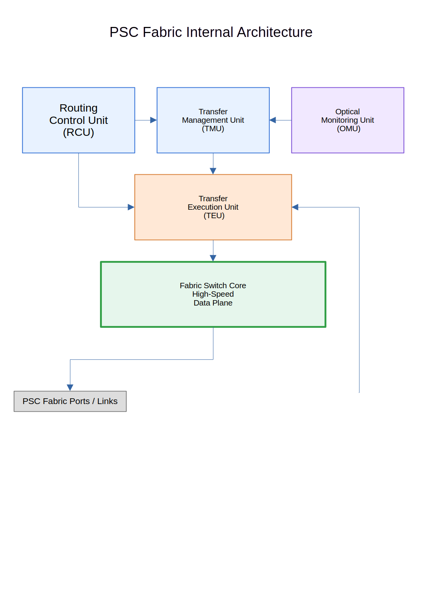

# Photon System Controller (PSC)

🇯🇵 日本語 | 🇺🇸 English → README.md

安定性と信頼性に基づいて、最も安定し信頼できるネットワーク経路を動的に選択する
ファブリック駆動型システムです。単なる最短経路選択ではありません。

---

## なぜ PSC なのか？

- 不安定なネットワーク経路を自動的に回避
- 生の速度よりも信頼性と安定性を優先
- ネットワーク状態の変化に応じてリアルタイムに適応
- 意思決定をネットワークファブリック内部へ移動

PSC は単なるデータ転送層ではなく、
**意思決定を行うルーティングシステム**です。

PSC は通常動作、劣化、回復のすべての段階において、
即時的な性能改善よりも安定性を優先します。

---

## PSC とは何か？

PSC（Photon System Controller）は、安定性を重視する
ファブリック制御アーキテクチャです。
従来の CPU 中心設計から一部の制御判断とデータ移動を切り離し、
通信ファブリック内部へ移します。

PSC は、不安定なピークスループットよりも、
破綻しにくい挙動を優先します。
対象は AI、HPC、データセンター、および
不安定なピーク性能よりも安定挙動が重要な分散システムです。

中核となる関心は、制御された回復、oscillation 抑制、
trust-aware routing、RULE 駆動の意思決定制御です。

---

## なぜ Photon なのか？

"Photon" は、光リンク、高速インターコネクト、path レベルの観測を
第一級の制御入力として扱う fabric-oriented な制御モデルを示します。

この README では、まず control-plane model を中心に説明しています:
安定 routing、recovery、trust、oscillation 抑制です。
photonic / optical fabric の詳細は fabric および architecture 文書で展開します。

---

## 設計思想

PSC は単なる高速通信だけを目的としたものではありません。
大規模分散システムにおいて、安定性、信頼性を考慮した制御、
封じ込め、回復性を重視するように設計されています。

- English:
  docs/specification/published/vision/psc_design_philosophy_v0.1_en.md

- Japanese:
  docs/specification/published/vision/psc_design_philosophy_v0.1_ja.md

---

## 推奨される読み進め方

初めて読む場合は、以下の順序を推奨します。

| 順序 | セクション | 目的 |
| --- | --- | --- |
| 1 | PSC とは何か？ | 安定性重視の制御目標を把握する |
| 2 | コア構成要素 | 図や仕様を読む前に主要用語を確認する |
| 3 | [Quick Start](QUICK_START_ja.md) | PSC simulation を実行し、生成ログを確認する |
| 4 | 検証 / Evidence | RULE、シナリオ、ログの対応関係を追う |
| 5 | アーキテクチャ概要 | RCU、Resolver、転送、Fabric の位置づけを確認する |
| 6 | 仕様 | 公開済みの安定モデルと発展中のモデルを区別する |
| 7 | クイックデモ / 検証ログ | 生成ログから挙動を再現する |

---

## 追加の読み進め先

| 文書 | 目的 |
| --- | --- |
| [QUICK_START_ja.md](QUICK_START_ja.md) | PSC simulation を最小手順で実行し、生成ログを確認する |
| [Architecture Overview](docs/architecture/psc_architecture_overview_en.md) | PSC Fabric、Resolver、control flow のアーキテクチャ視点 |
| [Published Models](docs/specification/published/models/) | routing、control、recovery、trust、telemetry、fabric behavior の参照モデル |
| [Evidence Matrix](docs/specification/validation/psc_evidence_matrix_v0.1_ja.md) | RULE、シナリオ、ログの検証トレーサビリティ |

---

## コア構成要素

| 構成要素 | 役割 |
| --- | --- |
| Resolver | 意思決定制御モジュール。RCU の自律制御だけでは不十分な場合に、エスカレーション、override、システム全体の制御判断を扱います。 |
| RCU | Routing Control Unit。trust、score、cooldown、degradation、recovery rules に基づいて path を選択・維持します。 |
| TMU | Transfer Management Unit。転送レベルの意図、スケジューリング、制御判断から実行への受け渡しを調整します。 |
| TEU | Transfer Execution Unit。制御層が選択した実際の転送挙動を実行します。 |
| OMU | Optical Monitoring Unit。制御判断に使われる link、path、fabric 状態を観測します。 |
| Fabric | routing、monitoring、transfer control、decision feedback を統合する通信基盤です。 |

---

## スタートガイド（RCU Decision v0.1）

ここが PSC の中核です。

RCU Decision Model は、PSC が以下をどのように実現するかを定義します。

- 不安定経路の回避
- 信頼性と安定性を優先する判断
- 制御された切替による oscillation 防止

PSC を理解するには、ここから始めてください。
このモデルは、シミュレーションログによって実装・検証済みです。

**仕様を読む:**

docs/specification/published/models/psc_rcu_decision_model_v0.1_ja.md

**実行方法:**

コマンドは [検証ログ](#検証ログ) を参照してください。

**生成ログ:**

`sim/02_controlled/02_rcu_decision_v01/logs/`

## 検証 / Evidence

PSC の検証挙動は、RULE、シナリオ、ログを対応付ける
追跡可能なマッピングとして整理されています。

参照:

- docs/specification/validation/psc_evidence_matrix_v0.1_en.md
- docs/specification/validation/psc_evidence_matrix_v0.1_ja.md

推奨される検証フロー:

1. 仕様文書を読む
2. シミュレーションシナリオを実行する
3. Evidence Matrix を開く
4. 対応するログを確認する

この追跡可能性により、PSC の挙動は再現可能で、
監査可能であり、RULE ベースの制御判断と直接対応付けられます。

詳細な検証トレーサビリティは以下にあります。

docs/specification/validation/psc_evidence_matrix_v0.1_ja.md

確認ポイント:

- resolver_stability_conflict
- degraded / recovery behavior
- trust-aware decisions

---

## 検証ログ

以下のログは、PSC RCU Decision Model v0.1 の挙動を再現可能な形で検証するものです。
各ログは完全に再現可能であり、RULE ベースの意思決定 trace と直接対応しています。

すべてのログはシミュレーションから直接生成されており、
実際の実行挙動を反映しています。

**実行方法:**

[QUICK_START_ja.md](QUICK_START_ja.md) に最小実行手順をまとめています。

**生成ログ:**

| シナリオ | ログ |
| --- | --- |
| Resolver 安定性競合 + クールダウン | `sim/02_controlled/02_rcu_decision_v01/logs/rcu_decision_v01_resolver_stability_conflict_cooldown_rule_log.md` |
| Degraded → Recovery → Stabilization | `sim/02_controlled/02_rcu_decision_v01/logs/rcu_decision_v01_degraded_switch_recovery_rule_log.md` |
| Resolver による切替判断 | `sim/02_controlled/02_rcu_decision_v01/logs/rcu_decision_v01_resolver_switch_rule_log.md` |

**シナリオ説明:**

| シナリオ | 示される挙動 | RULE 参照 |
| --- | --- | --- |
| Resolver 安定性競合 + クールダウン | スコアがほぼ同等の経路間で安定性の競合が発生し、Resolver へのエスカレーションが発生します。クールダウンは連続エスカレーションを防ぎ、ヒステリシスは安定性を維持します。 | `RULE-05_ESCALATE_conflict`, `RULE-12_COOLDOWN_active`, `RULE-01_KEEP_score` |
| Degraded → Recovery → Stabilization | 全 path の trust が低下し、degraded operation が強制されます。PSC は安全側へ fallback し、その後条件が改善すると回復します。 | `RULE-09_DEGRADE_switch`, `RULE-08_DEGRADE_keep`, `RULE-10_RECOVERY_trigger`, `RULE-11_RECOVERY_cooldown`, `RULE-01_KEEP_score` |
| Resolver による切替判断 | スコアがほぼ同等で trust に大きな差がある場合、Resolver へのエスカレーションが発生します。Resolver は選択中 path を明示的に切り替えます。 | `RULE-05_ESCALATE_conflict`, `RULE-14_RESOLVER_switch`, `RULE-12_COOLDOWN_active`, `RULE-01_KEEP_score` |

## これらのログが示すこと

- PSC は曖昧な状況で不要な切替を避ける
- PSC は trust 条件が失敗した場合に安全に degraded へ移行する
- PSC は oscillation なしに予測可能に回復する
- すべての判断は明示的な RULE 定義へ追跡できる

> PSC は最適化エンジンではありません。
> **障害時にも破綻しない意思決定エンジン**です。

### リカバリ挙動（重要）

PSC は保守的なリカバリ戦略を採用しています。

一度劣化した path が回復し、再び最良性能の path になった場合でも、
現在選択中の path が安定かつ信頼できる状態であれば、
PSC は即座に切り戻しません。

この挙動は、性能改善の追従よりも安定性を優先し、
回復後の不要な切替を防ぐためのものです。

### リカバリ挙動の比較（v0.1 vs v0.2）

以下の比較ログは、保守的な recovery hold（v0.1）と
段階的 recovery return（v0.2）の違いを示します。

**ログ:**
[Recovery Comparison Log (v0.1 vs v0.2)](sim/02_controlled/06_recovery_return_v02/logs/rcu_decision_v02_recovery_return_vs_v01_recovery_hold_log.md)

**主な違い:**

- v0.1:
  元の path が回復しても、現在の安定 path を維持する

- v0.2:
  段階的復帰を導入:
  RECOVERY_CANDIDATE → VALIDATION → RETURN_ELIGIBLE → RETURN_SWITCH

この比較は、PSC が安定性の保証を維持しながら、
安定性優先の hold 挙動から、staged return、progressive migration、
recovery ramp 的な検証を通じた制御された適応性へ発展することを示しています。

---

## クイックデモ

PSC には 2 種類のデモモードがあります。

| デモ | 実行方法 | 確認できる内容 |
| --- | --- | --- |
| 静的デモ | `python3 sim/04_demo/run_psc_demo.py` | 基本的な trust-aware routing と、最短 path よりも安定した path を優先する挙動 |
| 動的デモ | `python3 sim/04_demo/run_psc_dynamic_demo.py` | リアルタイムな routing adaptation、不安定 path の回避、trust に基づく意思決定の変化 |

---

## アーキテクチャ概要

PSC は、システム制御を中央集権的な CPU から通信ファブリックへ移します。

**重要な考え方:**

- 制御はファブリック全体に分散される
- データフローと意思決定が統合される

この図は、従来の CPU 中心アーキテクチャと
PSC のファブリック駆動モデルを比較しています。

---

### Resolver 制御モデル

この図は、PSC 内部で意思決定がどのように行われるかを示します。

**主な挙動:**

- 通常時は RCU が自律的に動作
- escalation または override が必要な場合のみ Resolver が介入
- 意思決定制御は実行から分離される

PSC は単なるデータ転送システムではありません。
**意思決定を内包したファブリックアーキテクチャ**です。

---

## データ転送フロー

この図は、PSC がファブリック内でデータ転送判断をどのように実行するかを示します。

**注目ポイント:**

- コンポーネント間のデータフロー
- routing decision が転送挙動へ与える影響
- 制御層と実行層の相互作用

---

## ファブリック内部構造

この図は、PSC ファブリックの内部構造を示します。

**注目ポイント:**

- 各モジュールの役割（RCU, TMU, TEU, OMU）
- 制御と実行の分離
- ファブリック内部でコンポーネントがどのように接続されるか

---

## アーキテクチャ読解のヒント

アーキテクチャ図は、単なる接続関係ではなく、
制御フローを示す文書として読むと理解しやすくなります。

- まず、判断がどこで行われるかを見る: 通常時は RCU、エスカレーション時は Resolver
- 次に、その判断がどう実行されるかを見る: TMU による調整、TEU による転送挙動
- 最後に、判断材料がどこから来るかを見る: OMU の観測と fabric state

この順序で読むと、PSC の制御哲学が見えます。
まず自律的な局所制御を行い、必要な場合にのみ保守的にエスカレーションします。

---

## ドキュメント

PSC を理解するには、以下から始めてください。

- [Architecture Overview](docs/architecture/psc_architecture_overview_en.md)
- [Architecture Map](docs/architecture/psc_architecture_map_v0.1_en.md)
- [Specification](docs/specification/)

---

## 仕様

PSC は、公開済みの参照モデルと、意図的に発展中の設計領域を分けています。
発展中の領域は、公開済みの安定性モデルを弱めるものではなく、
アーキテクチャの制御範囲を広げるものです。

### 公開済み / 安定文書

これらの文書は、安定した参照レベルの仕様です。

| 領域 | English | Japanese |
| --- | --- | --- |
| PSC Architecture Specification v1.0 | docs/specification/published/architecture/psc_architecture_spec_v1.0_en.md | docs/specification/published/architecture/psc_architecture_spec_v1.0_ja.md |
| RCU Decision Model v0.1 | docs/specification/published/models/psc_rcu_decision_model_v0.1_en.md | docs/specification/published/models/psc_rcu_decision_model_v0.1_ja.md |
| Routing Model v0.1 | docs/specification/published/models/psc_routing_model_v0.1_en.md | docs/specification/published/models/psc_routing_model_v0.1_ja.md |
| Congestion Control Model v0.1 | docs/specification/published/models/psc_congestion_control_model_v0.1_en.md | docs/specification/published/models/psc_congestion_control_model_v0.1_ja.md |
| PSC AI Behavior Model v0.1 | docs/specification/published/psc_ai_behavior_model_v0.1_en.md | docs/specification/published/psc_ai_behavior_model_v0.1_ja.md |

---

### 実験的 / 発展中の文書

これらの文書は、baseline model 以降の制御されたアーキテクチャ発展を示します。

| 領域 | English | Japanese |
| --- | --- | --- |
| RCU Recovery Return Model v0.2 | docs/specification/published/models/psc_rcu_recovery_return_model_v0.2_en.md | docs/specification/published/models/psc_rcu_recovery_return_model_v0.2_ja.md |
| Resolver Arbitration Extension Model v0.2x | docs/specification/published/models/psc_resolver_arbitration_extension_model_v0.2x_en.md | docs/specification/published/models/psc_resolver_arbitration_extension_model_v0.2x_ja.md |
| Recovery Return Extension Model v0.2x | docs/specification/published/models/psc_recovery_return_extension_model_v0.2x_en.md | docs/specification/published/models/psc_recovery_return_extension_model_v0.2x_ja.md |

これらは未完成の基盤としてではなく、意図的な発展領域として扱います。
新しい制御面を探索しながらも、安定性重視の回復と
RULE 駆動の意思決定モデルは baseline として維持されます。

---

### コア仕様

| 領域 | English | Japanese |
| --- | --- | --- |
| Resolver Specification v0.1 | docs/specification/resolver/psc_resolver_spec_v0.1_en.md | docs/specification/resolver/psc_resolver_spec_v0.1_ja.md |

Resolver は、状態ベース制御、権限モード、制約ベース出力を含む
PSC の意思決定制御モデルを定義します。

---

## 主要コンセプト

PSC は以下の原則に基づいています。

- ファブリック駆動型コンピュータアーキテクチャ
- 受信側主導データ転送
- チャンクベース転送
- 輻輳認識ルーティング
- ポリシー認識ルーティング
- 信頼性考慮ルーティング
- 適応型ファブリック制御

---

## 短い用語集

| 用語 | 意味 |
| --- | --- |
| RULE | 挙動を再現可能・監査可能にするための明示的な判断条件です。 |
| Trust | path に対する運用上の確信度です。reliability、policy 適合、validation 状態、観測された挙動を含みます。 |
| エスカレーション | RCU の自律判断から Resolver 制御へ判断権限を移すことです。 |
| クールダウン | 連続した切替や連続エスカレーションを抑制する期間です。 |
| Degraded mode | trust や path 条件が通常選択に不十分な場合の制御された動作状態です。 |
| Recovery | 即時の性能追従ではなく、安定した遷移を通じて劣化状態から戻ることです。 |
| Oscillation resistance | 急速な切替が信頼性を下げる状況で、安定した挙動を優先する性質です。 |

---

## ネットワーク routing を超えて

PSC はデータセンター規模の routing 制御だけを目的としたものではありません。

同じ制御思想は以下にも適用可能です。

- CPU-GPU ローカル fabric
- accelerator interconnect
- ラックスケール通信
- photonic internal bus
- trusted high-speed local transfer domain

これにより PSC は、従来型ネットワークを超え、
fabric-centric なコンピュータアーキテクチャへ拡張可能です。

この見方では、fabric は単なる転送層ではありません。
transfer、observation、recovery、control decision が統合される場所になります。

---

## システムアーキテクチャ

PSC は以下を接続する通信ファブリックを導入します。

- CPU
- GPU
- メモリ
- ストレージ
- ネットワーク
- アクセラレータ

すべての通信は PSC Fabric を通過します。

---

## 記事

コンセプト解説はこちら。

[https://zenn.dev/takanori_psc/articles/73827700dc68a6](https://zenn.dev/takanori_psc/articles/73827700dc68a6)

---

## プロジェクト状況

PSC には、安定性重視の制御挙動に関する公開済み参照モデルと検証ログがあります。
Fabric レベルの仕様はアーキテクチャ発展の一部として継続的に拡張されますが、
保守的な回復と RULE 駆動の意思決定制御は中核制約として維持されます。

---

## 作者

T. Hirose
Independent architecture research project

---

## コントリビューション

貢献、議論、アイデアを歓迎します。

`CONTRIBUTING.md` を参照してください。

---
