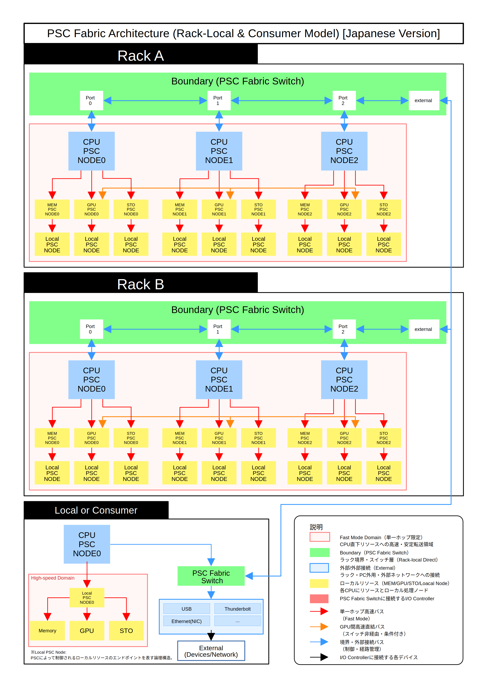

# PSC Fabric アーキテクチャ

このディレクトリは、PSC Fabricの中核アーキテクチャ図を格納しています。

## 図一覧

- Rack-Local & Consumer Model（英語 / 日本語）

## アーキテクチャ図

## 概要

PSC Fabricは、ファブリック中心の通信アーキテクチャであり、
厳格な境界制御と単一ホップによる高速データドメインを特徴とします。

すべての外部通信は、PSC Fabric Switchを経由して厳格に制御されます。

## 特徴

- Fast Mode Domain（単一ホップ通信）
- Boundaryによる制御とセキュリティ
- 外部I/Oの完全分離
- GPU間の直接通信（条件付き）