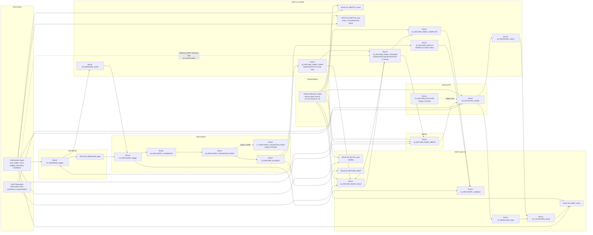

# PSC Rule Dependency Diagram

This diagram uses the active rule names from the Evidence Matrix and current
simulation logs. Published RCU model processing stages are `STEP-*`, not
operational `RULE-*` identifiers.

## Dependency Notes

| Rule | Dependency / ownership note |
|------|-----------------------------|
| RULE-01 | Default local keep after escalation, cooldown, recovery, and switch gates do not force action. |
| RULE-02 | Depends on local score improvement reaching switch threshold. |
| RULE-03 | Active in collision matrix as a trust-switch candidate, but not promoted to Verified without a dedicated final-action scenario. |
| RULE-04 | Verified safety block. It takes priority over `RULE-02_SWITCH_score` and `RULE-03_SWITCH_trust` in `trust_block_vs_switch`. |
| RULE-05 | Depends on ambiguity/conflict and invokes Resolver. |
| RULE-06 | Future reserved slot; no current active Evidence Matrix owner. |
| RULE-07 | Depends on selected/current path invalidation or no valid path. |
| RULE-08 | Depends on degraded mode with maintainable fallback. |
| RULE-09 | Depends on degraded mode requiring fallback selection change. |
| RULE-10 | Depends on DEGRADED mode plus stable trusted recovery path. |
| RULE-11 | Depends on recovery or return completion setting recovery cooldown. |
| RULE-12 | Depends on Resolver execution setting resolver cooldown. |
| RULE-13 | Depends on Resolver returning current selection. |
| RULE-14 | Depends on Resolver returning a different selection. |
| RULE-15 | Depends on a recovered path meeting trust and stability candidate thresholds. |
| RULE-16 | Depends on candidate continuation through validation window. |
| RULE-17 | Legacy Concept; current code emits `RULE-18` directly after `RULE-16`. |
| RULE-18 | Depends on validation window completion. |
| RULE-19 | Verified v0.2 direct return switch. It is not the Return Ramp start owner. |
| RULE-20 | Depends on return eligibility with insufficient return margin. |
| RULE-21 | Operational `RULE-21` owner is `RULE-21_RETURN_RAMP_ADVANCE`; LIGHT variant remains Hold unless promoted. |
| RULE-21_RETURN_ESCALATE | Legacy Concept retained only for v0.2 history. |
| RULE-22 | Current authoritative LIGHT behavior resolves to Hold unless FULL promotion or explicit gates exist. |
| RULE-23 | Depends on unstable/invalid recovered path, hard failure, or abort class. |
| RULE-24 | Depends on progressive ramp reaching target weight. |
| RULE-25 | Experimental v0.3 ramp entry; replaces the v0.2 direct return execution point but is not semantically identical to `RULE-19`. |
