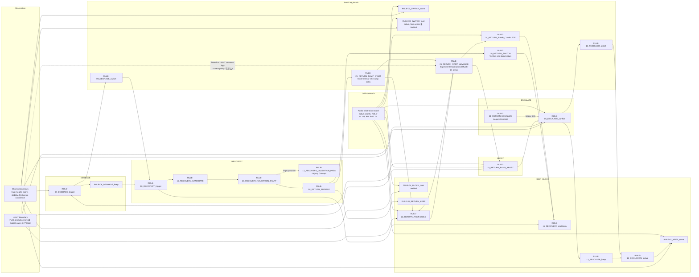

# PSC Rule Dependency Diagram

この図は Evidence Matrix と現在の simulation logs の active rule 名を使用する。
Published RCU model の内部処理段階は `STEP-*` であり、運用上の `RULE-*`
identifier ではない。

## Dependency Notes

| Rule | Dependency / ownership note |
|------|-----------------------------|
| RULE-01 | escalation、cooldown、recovery、switch gate が action を強制しない場合の default keep。 |
| RULE-02 | local score improvement が switch threshold に達することに依存する。 |
| RULE-03 | collision matrix では trust-switch candidate として active だが、final-action 専用 scenario までは Verified ではない。 |
| RULE-04 | Verified safety block。`trust_block_vs_switch` で `RULE-02_SWITCH_score` と `RULE-03_SWITCH_trust` より優先される。 |
| RULE-05 | ambiguity/conflict に依存し Resolver を呼び出す。 |
| RULE-06 | future reserved slot。現在の active Evidence Matrix owner はない。 |
| RULE-07 | selected/current path invalidation または no valid path に依存する。 |
| RULE-08 | maintainable fallback がある degraded mode に依存する。 |
| RULE-09 | fallback selection change が必要な degraded mode に依存する。 |
| RULE-10 | DEGRADED mode と stable trusted recovery path に依存する。 |
| RULE-11 | recovery または return completion が recovery cooldown を設定することに依存する。 |
| RULE-12 | Resolver execution が resolver cooldown を設定することに依存する。 |
| RULE-13 | Resolver が current selection を返すことに依存する。 |
| RULE-14 | Resolver が different selection を返すことに依存する。 |
| RULE-15 | recovered path が trust / stability candidate thresholds を満たすことに依存する。 |
| RULE-16 | candidate が validation window を継続することに依存する。 |
| RULE-17 | Legacy Concept。現在の code は `RULE-16` の直後に `RULE-18` を emit する。 |
| RULE-18 | validation window completion に依存する。 |
| RULE-19 | Verified v0.2 direct return switch。Return Ramp start の owner ではない。 |
| RULE-20 | return eligible だが return margin が不足する場合に依存する。 |
| RULE-21 | operational `RULE-21` owner は `RULE-21_RETURN_RAMP_ADVANCE`。LIGHT variant は promotion まで Hold。 |
| RULE-21_RETURN_ESCALATE | v0.2 history のためだけに残る Legacy Concept。 |
| RULE-22 | 現在の authoritative LIGHT behavior。FULL promotion または explicit gates まで Hold。 |
| RULE-23 | unstable/invalid recovered path、hard failure、abort class に依存する。 |
| RULE-24 | progressive ramp が target weight に到達することに依存する。 |
| RULE-25 | Experimental v0.3 ramp entry。v0.2 direct return execution point を置換するが `RULE-19` と同義ではない。 |
