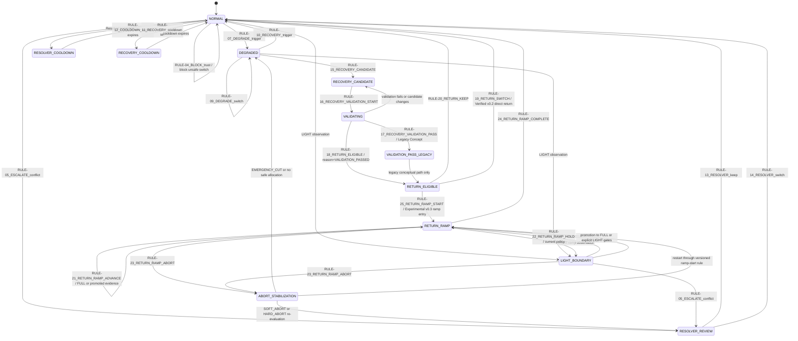

# PSC State Transition Diagram

この state model は local RCU mode、Resolver cooldown、v0.2 recovery return、
v0.3 recovery ramp、LIGHT boundary behavior、post-abort handling を統合する。

## State Notes

| State | Current repository owner | Notes |
|-------|--------------------------|-------|
| NORMAL | RCU decision simulations | default local scoring/keep/switch mode。 |
| DEGRADED | RCU decision simulations | trusted valid path がない、または selected path が reject された場合に入る。 |
| RESOLVER_REVIEW | Resolver arbitration simulations | ambiguity 時に呼ばれ、keep または switch を返す。 |
| RESOLVER_COOLDOWN | RCU simulations | Resolver escalation の連続発火を抑制する。 |
| RECOVERY_COOLDOWN | RCU simulations | recovery 直後の switch を抑制する。 |
| RECOVERY_CANDIDATE | Recovery return v0.2 | recovered path は即時再利用されず candidate になる。 |
| VALIDATING | Recovery return v0.2 | validation window で candidate を観測する。 |
| VALIDATION_PASS_LEGACY | Published recovery return v0.2 history | Legacy Concept。現在の code は `RULE-16` 直後に `RULE-18` を emit する。 |
| RETURN_ELIGIBLE | Recovery return v0.2 | candidate は競合可能になるが、selection は強制しない。 |
| RETURN_RAMP | v0.3 recovery ramp | Experimental。`RULE-25` で開始し、`RULE-21` through `RULE-24` を使う。 |
| LIGHT_BOUNDARY | Fast Mode LIGHT draft + stubs | 現在方針は、FULL promotion または explicit gates まで `RULE-22` Hold。 |
| ABORT_STABILIZATION | Abort handling draft + scenarios | post-abort stabilization 後に Resolver re-evaluation または emergency transition。 |
