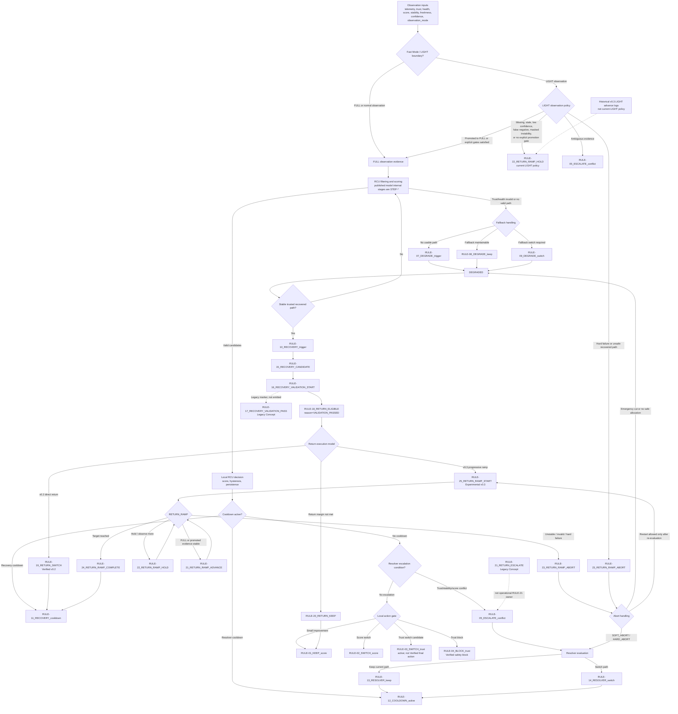

# Unified PSC Control Flow Review

This review diagram reflects the current repository behavior from the Evidence
Matrix, controlled simulations, LIGHT boundary drafts, abort handling drafts,
and the collision matrix scope note. It does not modify published
specifications or simulation code.

## Source Basis

- Operational rule traceability: `docs/specification/validation/psc_evidence_matrix_v0.1_en.md`
- Published RCU Decision Model: `docs/specification/published/models/psc_rcu_decision_model_v0.1_en.md`
- Recovery return and ramp behavior: `sim/02_controlled/06_recovery_return_v02/`
- LIGHT observation boundary: `docs/specification/draft/models/psc_fast_mode_light_observation_boundary_v0.1_en.md`
- Abort handling: `docs/specification/draft/models/psc_recovery_return_abort_handling_v0.1_en.md`
- Rule collision priority subset: `sim/02_controlled/09_rule_collision_matrix/`

## Namespace Note

The published RCU Decision Model now uses `STEP-*` identifiers for internal
processing stages. Operational `RULE-*` identifiers are owned by the Evidence
Matrix / validation namespace and simulation logs.

Legacy conceptual labels:

- `RULE-17_RECOVERY_VALIDATION_PASS` is a Legacy Concept. Current code moves
  from `RULE-16_RECOVERY_VALIDATION_START` directly to
  `RULE-18_RETURN_ELIGIBLE` with `reason="VALIDATION_PASSED"`.
- `RULE-21_RETURN_ESCALATE` is a Legacy Concept. Operational `RULE-21`
  ownership belongs to `RULE-21_RETURN_RAMP_ADVANCE`.

## Rule Ownership Map

| Rule | Current meaning | Category | Review status |
|------|-----------------|----------|---------------|
| RULE-01_KEEP_score | Keep selected path under hysteresis / small improvement | KEEP | Verified |
| RULE-02_SWITCH_score | Switch on clear score advantage | SWITCH | Verified |
| RULE-03_SWITCH_trust | Trust-driven switch candidate in collision matrix | SWITCH | Active in collision matrix; not Verified until final-action scenario exists |
| RULE-04_BLOCK_trust | Block unsafe switch by trust | KEEP / BLOCK | Verified |
| RULE-05_ESCALATE_conflict | Escalate trust/stability/score ambiguity to Resolver | ESCALATE | Verified |
| RULE-06 | No active Evidence Matrix owner | Reserved | Future reserved |
| RULE-07_DEGRADE_trigger | Enter DEGRADED when selected/current path is invalid | DEGRADE | Verified |
| RULE-08_DEGRADE_keep | Keep degraded fallback path | DEGRADE / KEEP | Verified |
| RULE-09_DEGRADE_switch | Switch to degraded fallback path | DEGRADE / SWITCH | Verified |
| RULE-10_RECOVERY_trigger | Return from DEGRADED to NORMAL when stable trusted path exists | RECOVERY | Verified |
| RULE-11_RECOVERY_cooldown | Suppress immediate post-recovery switching | RECOVERY / KEEP | Verified |
| RULE-12_COOLDOWN_active | Resolver cooldown suppresses repeated escalation | ESCALATE / KEEP guard | Verified |
| RULE-13_RESOLVER_keep | Resolver keeps current path | KEEP / RESOLVER | Verified |
| RULE-14_RESOLVER_switch | Resolver switches to different path | SWITCH / RESOLVER | Verified |
| RULE-15_RECOVERY_CANDIDATE | Register recovered path as candidate | RECOVERY | Verified |
| RULE-16_RECOVERY_VALIDATION_START | Start / continue recovery candidate validation | RECOVERY | Verified |
| RULE-17_RECOVERY_VALIDATION_PASS | Legacy validation-pass marker | RECOVERY | Legacy Concept |
| RULE-18_RETURN_ELIGIBLE | Candidate becomes eligible for return | RECOVERY | Verified |
| RULE-19_RETURN_SWITCH | Verified v0.2 direct return switch | RECOVERY / SWITCH | Verified |
| RULE-20_RETURN_KEEP | Keep current path when return margin is not met | RECOVERY / KEEP | Verified |
| RULE-21_RETURN_RAMP_ADVANCE | Advance recovery ramp under FULL / promoted conditions | RECOVERY / SWITCH | Experimental; operational RULE-21 owner |
| RULE-21_RETURN_ESCALATE | v0.2 return escalation label | ESCALATE | Legacy Concept |
| RULE-22_RETURN_RAMP_HOLD | Hold current ramp weight | RECOVERY / KEEP | Experimental |
| RULE-23_RETURN_RAMP_ABORT | Abort active return ramp attempt | ABORT | Experimental |
| RULE-24_RETURN_RAMP_COMPLETE | Complete progressive reintegration | RECOVERY / SWITCH | Experimental |
| RULE-25_RETURN_RAMP_START | v0.3 progressive ramp entry | RECOVERY / RAMP START | Experimental; outside RULE-01..24 Verified namespace |

## Collision Matrix Scope

The collision matrix is a partial arbitration model, not a complete PSC-wide
rule arbitration engine. Current active collision coverage focuses on:

- core keep/switch/trust/block/escalation rules: `RULE-01` through `RULE-05`
- recovery ramp hold/abort/complete rules: `RULE-22` through `RULE-24`

Many recovery, resolver, and degraded-mode rules from `RULE-07` through
`RULE-21` are active in PSC evidence and logs, but their collision predicates
and priorities are not integrated into the collision matrix yet.

## Unified Flowchart

