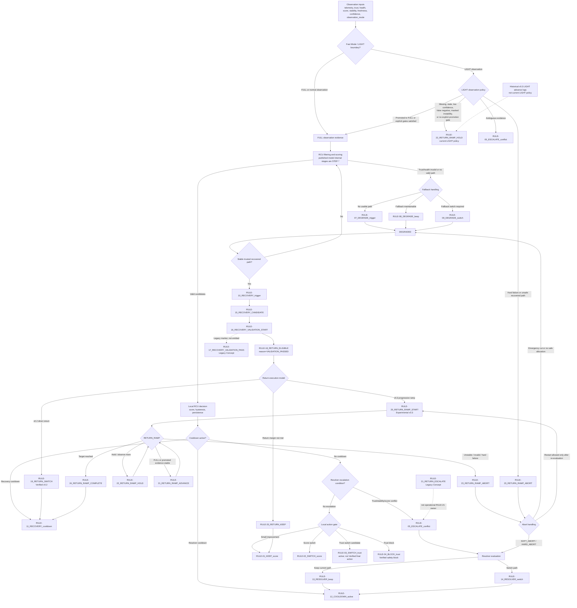

# 統合 PSC 制御フロー レビュー

本レビュー図は、現在の Evidence Matrix、制御シミュレーション、
LIGHT boundary draft、abort handling draft、および collision matrix の
scope note に基づく。公開仕様およびシミュレーションコードは変更しない。

## 参照元

- 運用 RULE traceability: `docs/specification/validation/psc_evidence_matrix_v0.1_ja.md`
- Published RCU Decision Model: `docs/specification/published/models/psc_rcu_decision_model_v0.1_ja.md`
- Recovery return / ramp behavior: `sim/02_controlled/06_recovery_return_v02/`
- LIGHT observation boundary: `docs/specification/draft/models/psc_fast_mode_light_observation_boundary_v0.1_ja.md`
- Abort handling: `docs/specification/draft/models/psc_recovery_return_abort_handling_v0.1_ja.md`
- Rule collision priority subset: `sim/02_controlled/09_rule_collision_matrix/`

## Namespace Note

Published RCU Decision Model は、内部処理段階を `STEP-*` で表す。
運用上の `RULE-*` identifier は Evidence Matrix / validation namespace と
simulation logs が所有する。

Legacy Concept:

- `RULE-17_RECOVERY_VALIDATION_PASS` は Legacy Concept。現在の code は
  `RULE-16_RECOVERY_VALIDATION_START` から `RULE-18_RETURN_ELIGIBLE` へ
  `reason="VALIDATION_PASSED"` で直接進む。
- `RULE-21_RETURN_ESCALATE` は Legacy Concept。運用上の `RULE-21` 所有者は
  `RULE-21_RETURN_RAMP_ADVANCE` である。

## RULE 所有関係

| Rule | 現在の意味 | Category | Review status |
|------|------------|----------|---------------|
| RULE-01_KEEP_score | hysteresis / 小幅改善時に selected path を維持 | KEEP | Verified |
| RULE-02_SWITCH_score | 明確な score 優位で切替 | SWITCH | Verified |
| RULE-03_SWITCH_trust | collision matrix 内の trust-driven switch candidate | SWITCH | Active; final-action 専用検証まで Verified ではない |
| RULE-04_BLOCK_trust | trust により unsafe switch を block | KEEP / BLOCK | Verified |
| RULE-05_ESCALATE_conflict | trust/stability/score の曖昧性を Resolver へ escalation | ESCALATE | Verified |
| RULE-06 | active Evidence Matrix owner なし | Reserved | Future reserved |
| RULE-07_DEGRADE_trigger | selected/current path invalid で DEGRADED へ | DEGRADE | Verified |
| RULE-08_DEGRADE_keep | degraded fallback path を維持 | DEGRADE / KEEP | Verified |
| RULE-09_DEGRADE_switch | degraded fallback path へ切替 | DEGRADE / SWITCH | Verified |
| RULE-10_RECOVERY_trigger | stable trusted path で DEGRADED から NORMAL へ | RECOVERY | Verified |
| RULE-11_RECOVERY_cooldown | recovery 直後の再切替を抑制 | RECOVERY / KEEP | Verified |
| RULE-12_COOLDOWN_active | Resolver cooldown 中の再 escalation 抑制 | ESCALATE / KEEP guard | Verified |
| RULE-13_RESOLVER_keep | Resolver が current path を維持 | KEEP / RESOLVER | Verified |
| RULE-14_RESOLVER_switch | Resolver が別 path へ切替 | SWITCH / RESOLVER | Verified |
| RULE-15_RECOVERY_CANDIDATE | recovered path を candidate 登録 | RECOVERY | Verified |
| RULE-16_RECOVERY_VALIDATION_START | recovery candidate validation を開始/継続 | RECOVERY | Verified |
| RULE-17_RECOVERY_VALIDATION_PASS | validation pass marker | RECOVERY | Legacy Concept |
| RULE-18_RETURN_ELIGIBLE | candidate を return eligible にする | RECOVERY | Verified |
| RULE-19_RETURN_SWITCH | Verified v0.2 direct return switch | RECOVERY / SWITCH | Verified |
| RULE-20_RETURN_KEEP | return margin 未達で current path 維持 | RECOVERY / KEEP | Verified |
| RULE-21_RETURN_RAMP_ADVANCE | FULL / promoted 条件下で recovery ramp advance | RECOVERY / SWITCH | Experimental; operational RULE-21 owner |
| RULE-21_RETURN_ESCALATE | v0.2 return escalation label | ESCALATE | Legacy Concept |
| RULE-22_RETURN_RAMP_HOLD | current ramp weight 維持 | RECOVERY / KEEP | Experimental |
| RULE-23_RETURN_RAMP_ABORT | active return ramp attempt を abort | ABORT | Experimental |
| RULE-24_RETURN_RAMP_COMPLETE | progressive reintegration 完了 | RECOVERY / SWITCH | Experimental |
| RULE-25_RETURN_RAMP_START | v0.3 progressive ramp entry | RECOVERY / RAMP START | Experimental; RULE-01..24 Verified namespace 外 |

## Collision Matrix Scope

Collision matrix は partial arbitration model であり、PSC 全体の完全な
rule arbitration engine ではない。現在の active collision coverage は以下に集中する。

- core keep/switch/trust/block/escalation rules: `RULE-01` through `RULE-05`
- recovery ramp hold/abort/complete rules: `RULE-22` through `RULE-24`

`RULE-07` through `RULE-21` の多くは PSC evidence / logs 上では active だが、
collision predicates と priorities は collision matrix に未統合である。

## 統合 Flowchart

